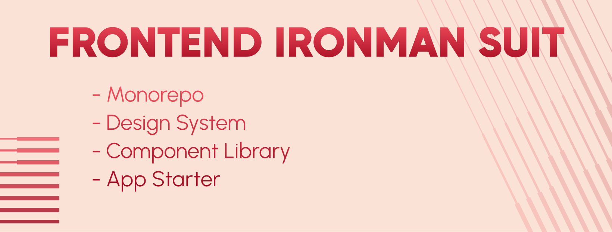
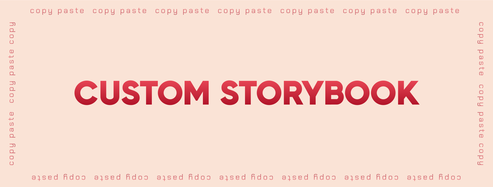

[](./LICENSE) [](https://nodejs.org/) [](https://pnpm.io/) [](https://react.dev/) [](https://www.typescriptlang.org/) [](https://biomejs.dev/) [](https://turbo.build/repo)

A React monorepo starter kit with a 78-component design system built on Chakra UI 3 and Ark UI 5, starter templates for every platform you would want to ship on, and production tooling that works out of the box. Build web apps, mobile apps, desktop apps, and browser extensions from one TypeScript codebase.

No boilerplate setup, no configuration rabbit holes. Clone it and start building.

View the documentation site here: https://marwaneboudriga.dev/rocket

If this helped you out, show some support and buy me a coffee: https://ko-fi.com/marwaneboudriga

---

## Contributing

Contributions are welcome. Please read [CONTRIBUTING.md](./CONTRIBUTING.md) before submitting a pull request.

Have a question or idea? Start a thread in [GitHub Discussions](https://github.com/mboudriga/rocket/discussions). Discord coming soon.

---

## Table of Contents

- [**Key Features**](#key-features)
- [**App Starters**](#app-starters)
- [**Which Starter Should I Use?**](#which-starter-should-i-use)
- [**Monorepo Architecture**](#monorepo-architecture)
- [**Rocket UI**](#rocket-ui)
- [**Custom Storybook**](#custom-storybook)
- [**Technologies**](#technologies)
- [**Getting Started**](#getting-started)

---

## Key Features


### Multi-Platform Starters

Eight app templates covering web (SPA and SSR), mobile (iOS and Android), desktop (Windows, macOS, Linux), and browser extensions (Chrome, Firefox, Edge). Each one comes pre-wired with Rocket UI, TypeScript, testing, and linting. Pick the right tool for the job.

### 78-Component Design System

Rocket UI is a complete component library across 9 categories, built on Chakra UI 3 and Ark UI 5. It has a simplified props API that removes the boilerplate of compound sub-components, integrated form field wrappers for consistent validation UX, WCAG AA accessibility baked into the theme, and full Storybook 10 documentation. Your apps import from `@rocket/ui` and nothing else.

### Production-Grade Tooling

Everything is configured and wired together out of the box. Biome handles linting and formatting (replacing ESLint and Prettier with one tool). Lefthook runs git hooks for pre-commit checks. Vitest runs unit tests. Playwright runs E2E tests. knip detects unused code and dependencies. sherif audits dependency versions. commitlint enforces conventional commits. Turborepo caches everything so repeated builds are near-instant.

---

## App Starters

Every starter lives in the `apps/` directory and shares the same Engine packages. They all use `@rocket/ui` for their UI layer, TypeScript for type safety, and come configured with Biome, Vitest, and Playwright.

| Starter | Platform | Framework | What It Does |
|---------|----------|-----------|--------------|
| `vite-tanstack-router-starter` | Web (SPA) | Vite 8 + TanStack Router 1 | **Flagship.** File-based routing, type-safe search params, auth guards, TanStack Query integration |
| `vite-react-router-starter` | Web (SPA) | Vite 8 + React Router 7 | React Router v7 with Vite bundling |
| `tanstack-start-starter` | Web (SSR) | TanStack Start | **Personal favorite.** Full-stack SSR with streaming, built on TanStack Router |
| `nextjs-app-starter` | Web (SSR) | Next.js 16 | App Router with React Server Components, API routes, middleware |
| `nextjs-pages-starter` | Web (SSR) | Next.js 16 | Pages Router for traditional SSR patterns |
| `capacitor-mobile-starter` | iOS / Android | Capacitor 8 | Native mobile with camera, geolocation, push notifications, haptics |
| `tauri-desktop-starter` | Desktop | Tauri 2 | Cross-platform desktop with a Rust backend. Tiny bundle sizes |
| `wxt-extension-starter` | Browser Extension | WXT | Chrome, Firefox, and Edge extensions with hot reload |

---

### Which Starter Should I Use?

**Building a single-page app?**
Start with `vite-tanstack-router-starter`. It is the flagship starter with file-based routing, type-safe search params, and the most mature setup in this repo. If your team already knows React Router, go with `vite-react-router-starter` instead.

**Need server-side rendering?**
Use `tanstack-start-starter` if you want full-stack SSR and streaming but do note that this is labeled RC but stable. I believe TanStack Start will take over when released and I use this for my personal projects. Use `nextjs-app-starter` if you want React Server Components, API routes, middleware, and the broader Next.js ecosystem. Use `nextjs-pages-starter` if you are migrating an existing Pages Router project.

**Building a mobile app?**
`capacitor-mobile-starter` gives you iOS and Android from a single React codebase. It ships with Capacitor 8 plugins for camera, geolocation, push notifications, haptics, splash screen, and more. Build your UI with Rocket UI and deploy to both app stores.

**Building a desktop app?**
`tauri-desktop-starter` builds lightweight cross-platform desktop apps for Windows, macOS, and Linux. Tauri v2 uses a Rust backend instead of bundling Chromium, so your app ships at a fraction of the size you would get with Electron.

**Building a browser extension?**
`wxt-extension-starter` handles the full lifecycle for Chrome, Firefox, and Edge extensions. WXT manages the manifest, content scripts, background workers, popups, and hot reload during development.

**Not sure yet?**
Start with `vite-tanstack-router-starter`. It is the simplest to get running and you can always add SSR later with TanStack Start, or switch to a different framework entirely. The component library stays the same regardless of which app starter you use.

---

## Monorepo Architecture


### Overview

Rocket is a [pnpm](https://pnpm.io/) monorepo. Shared packages live in `engine/`. Apps live in `apps/`.

### Engine

Reusable packages that the apps consume:

- [**@rocket/ui**](./engine/rocket-ui/) - 78-component design system with Storybook documentation
- [**@rocket/typescript-config**](./engine/typescript-config/) - Shared TypeScript configurations (base, Vite + React, Next.js, library)
- [**@rocket/playwright-config**](./engine/playwright-config/) - Shared Playwright configuration with auth support and Chakra UI helpers

### Apps

Eight application starters built on the Engine packages. Each app is independent and can be deployed on its own.

### How It Works

[pnpm workspaces](https://pnpm.io/workspaces) link everything together. A central version catalog in `pnpm-workspace.yaml` pins every shared dependency to a single version, so there are no version mismatches across packages. [Turborepo](https://turbo.build/repo) handles task orchestration, parallel execution, and caching. When you run `pnpm build`, Turborepo figures out the dependency graph, builds packages in the right order, and caches the results. The second time you build, unchanged packages skip entirely.

```
rocket/
├── apps/                           # Application starters
│   ├── vite-tanstack-router-starter/   # Flagship SPA
│   ├── tanstack-start-starter/         # Full-stack SSR
│   ├── nextjs-app-starter/             # Next.js App Router
│   ├── nextjs-pages-starter/           # Next.js Pages Router
│   ├── vite-react-router-starter/      # React Router + Vite
│   ├── capacitor-mobile-starter/       # iOS / Android
│   ├── tauri-desktop-starter/          # Desktop
│   └── wxt-extension-starter/          # Browser extension
│
├── engine/                         # Shared packages
│   ├── rocket-ui/                      # @rocket/ui
│   ├── typescript-config/              # @rocket/typescript-config
│   └── playwright-config/              # @rocket/playwright-config
│
├── turbo.json                      # Turborepo task configuration
├── pnpm-workspace.yaml             # Workspace and version catalog
├── biome.json                      # Linting and formatting
├── lefthook.yml                    # Git hooks
├── knip.json                       # Unused code detection
└── commitlint.config.js            # Commit message rules
```

---

## Rocket UI

Rocket UI is the shared component library that all apps import from. It wraps [Chakra UI 3](https://chakra-ui.com/) and [Ark UI 5](https://ark-ui.com/) into a single, simplified API with 78 components across 9 categories.

### Components

| Category | Components | Examples |
|----------|-----------|----------|
| **Disclosure** | 3 | Accordion, Steps, Tabs |
| **Display** | 11 | Badge, Card, Carousel, DataList, QRCode, Stat, Table, Tag, Timeline |
| **Feedback** | 7 | Alert, Clipboard, EmptyState, Progress, ProgressCircle, Skeleton, Spinner |
| **Form** | 24 | Button, Checkbox, Combobox, DatePicker, FileUpload, Input, Select, Slider, Switch, Textarea |
| **Layout** | 10 | Box, Center, Divider, Flex, Float, Grid, ScrollArea, Splitter, Wrap |
| **Media** | 4 | AspectRatio, Avatar, Icon, Image |
| **Navigation** | 4 | Breadcrumb, Link, Menubar, Toolbar |
| **Overlay** | 10 | ActionBar, AlertDialog, ContextMenu, Dialog, Drawer, HoverCard, Menu, Popover, Tooltip |
| **Typography** | 5 | Code, Heading, Key, RichTextEditor, Text |

### Design Decisions

**Simplified props.** Most components use a flat props API instead of nested sub-components. A `Dialog` takes `title`, `buttons`, and `open` as props. A `Menu` takes `trigger` and `items`. Less boilerplate.

**Integrated form fields.** Every form component has built-in `label`, `hint`, `error`, `required`, `invalid`, and `disabled` props through an integrated FieldWrapper. No need to wrap inputs in separate Field components.

**Semantic color tokens.** Apps use tokens like `fg`, `fg.muted`, `bg.surface`, and `colorPalette.solid` instead of raw color values. These tokens automatically switch between light and dark mode.

**Custom breakpoints.** `mobile`, `tablet`, and `desktop` instead of the default `sm`, `md`, `lg`. Sized for real devices.

### Quick Example

```tsx
import { Button, Dialog, Input, Flex } from '@rocket/ui';

function CreateUserForm() {
  const [open, setOpen] = useState(false);

  return (
    <>
      <Button onClick={() => setOpen(true)}>
        Add User
      </Button>

      <Dialog
        open={open}
        onOpenChange={setOpen}
        title="Create User"
        buttons={[
          { children: 'Cancel', variant: 'ghost', onClick: () => setOpen(false) },
          { children: 'Save', colorPalette: 'blue', onClick: () => setOpen(false) },
        ]}
      >
        <Flex.V gap={4}>
          <Input label="Full name" required />
          <Input label="Email" type="email" hint="We will never share your email" required />
        </Flex.V>
      </Dialog>
    </>
  );
}
```

No Field wrappers or compound sub-components. Labels, hints, and validation are built into every form component.

---

## Custom Storybook



Rocket UI ships with a custom Storybook 10 setup designed to reduce boilerplate and make documentation feel natural instead of tedious. Three template types with copy-paste configuration setup handle the heavy lifting:

- [**DocsTemplate**](./engine/rocket-ui/.storybook/templates/DocsTemplate/) - Static documentation pages for guides and concepts. Write markdown, get formatted docs.
- [**StoryTemplate**](./engine/rocket-ui/.storybook/templates/StoryTemplate/) - Component stories with automated prop tables and examples. Copy-paste a story file next to your component and the template handles the rest.
- [**WidgetTemplate**](./engine/rocket-ui/.storybook/templates/WidgetTemplate/) - Embed external tools and documentation via iframes. Useful for tying in design tools, API docs, or dashboards. You can also built mini-apps for your unique use cases here.

The [Welcome Page](./engine/rocket-ui/.storybook/documentation/Welcome/) acts as a homepage with configurable announcements, external links, and an advanced component search.

Storybook includes dark mode support, actions and console logging, an accessibility addon for WCAG testing, a Vitest panel for running component tests inside the browser, and a live prop display to tweak and copy component code.

---

## Technologies


### Build and Dev

- [**pnpm 10**](https://pnpm.io/) - Fast, disk-efficient package manager with native monorepo support
- [**Turborepo 2**](https://turbo.build/repo) - Monorepo task runner with caching and parallel execution
- [**Vite 8**](https://vitejs.dev/) - Next-gen bundler using Rollup and esbuild under the hood
- [**TypeScript 6**](https://www.typescriptlang.org/) - Strict type safety with `noUncheckedIndexedAccess` and erasable syntax
- [**Node.js 24+**](https://nodejs.org/) - Runtime requirement

### UI

- [**React 19**](https://react.dev/) - UI framework with concurrent features and server component support
- [**Chakra UI 3**](https://chakra-ui.com/) - Design system and component library foundation
- [**Ark UI 5**](https://ark-ui.com/) - Headless component primitives powering Chakra UI 3
- [**React Icons**](https://react-icons.github.io/react-icons) - Icon library (Lucide icon set with `Lu` prefix)

### Routing and Data

- [**TanStack Router 1**](https://tanstack.com/router) - Type-safe file-based routing with search param validation
- [**TanStack Query 5**](https://tanstack.com/query) - Server state management, caching, and synchronization
- [**Zustand 5**](https://zustand.docs.pmnd.rs/) - Lightweight client state management with hooks
- [**React Hook Form 7**](https://react-hook-form.com/) - Performant form management with minimal re-renders
- [**Zod 3**](https://zod.dev/) - TypeScript-first schema validation
- [**ky**](https://github.com/sindresorhus/ky) - Lightweight HTTP client built on fetch

### Code Quality

- [**Biome 2**](https://biomejs.dev/) - Linter and formatter in one tool (replaces ESLint + Prettier)
- [**Lefthook 2**](https://github.com/evilmartians/lefthook) - Git hooks manager (replaces Husky)
- [**commitlint**](https://commitlint.js.org/) - Conventional commit message enforcement
- [**knip**](https://knip.dev/) - Detects unused code, exports, and dependencies
- [**sherif**](https://github.com/QuiiBz/sherif) - Monorepo dependency version auditing

### Testing

- [**Vitest 4**](https://vitest.dev/) - Unit test runner powered by Vite
- [**React Testing Library**](https://testing-library.com/) - DOM testing utilities for React components
- [**Playwright 1.59**](https://playwright.dev/) - Cross-browser E2E testing with codegen and auth support
- [**Storybook 10**](https://storybook.js.org/) - Component documentation and visual testing
- [**MSW 2**](https://mswjs.io/) - API mocking for tests and development

---

## Getting Started


### Prerequisites

- **Node.js 24+** - Check with `node -v`. Use [nvm](https://github.com/nvm-sh/nvm) or [fnm](https://github.com/Schniz/fnm) to manage versions.
- **pnpm 10+** - Install via `npm install -g pnpm` or see [pnpm.io/installation](https://pnpm.io/installation) for other methods. Verify with `pnpm -v`.

### Setup

```bash
# Clone the repo
git clone https://github.com/mboudriga/rocket.git
cd rocket

# Install all dependencies
pnpm install

# Start Storybook to explore Rocket UI
pnpm turbo dev --filter=@rocket/ui
```
### Adding a New App

1. Copy and rename any starter from `apps/`
2. Update the `name` field in the new app's `package.json`
3. Run `pnpm install` to link the workspace
4. Start developing locally with `pnpm turbo dev --filter=<your-new-app-name>`

The new app automatically has access to `@rocket/ui`, `@rocket/typescript-config`, `@rocket/playwright-config`.

---

And just like that, you have a monorepo with 8 starters, 78 components, and tooling that actually works together. Go build something.


